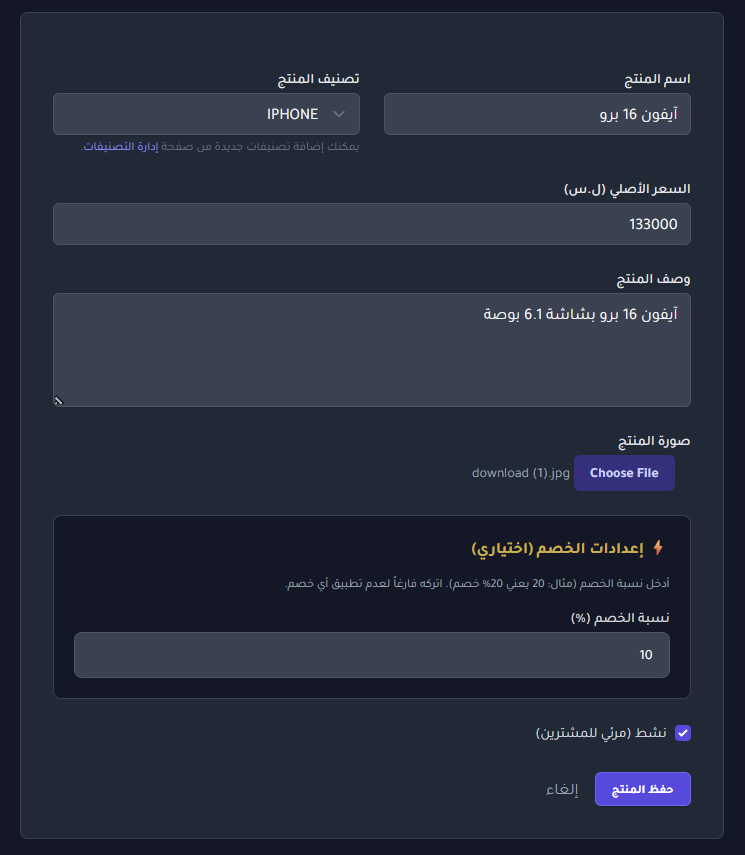
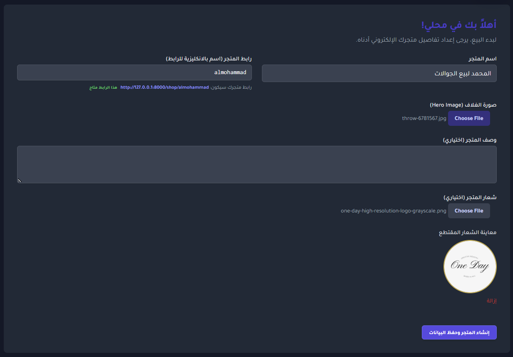
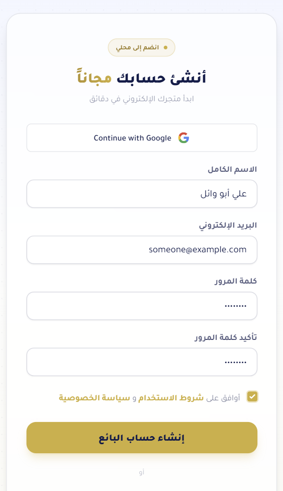

# Mahly (محلي)

Multi-vendor e-commerce platform for Arabic-speaking sellers. Sellers spin up a branded storefront under a unique slug, manage products/orders/promos from a dashboard, and buyers check out without needing an account. Built with Laravel 12, PostgreSQL, Blade + Alpine.js, and Tailwind CSS, with RTL support and Arabic typography throughout.

> **Status:** No longer deployed. This was previously live at mahly.org; it now exists as a portfolio project. The instructions below run it locally.

## Screenshots

| Storefront | Product form | Shop creation | Registration |
|---|---|---|---|
|  |  |  |  |

## Features

**Storefronts**
- Custom shop per seller at `/shop/{slug}`, with live slug availability check before creation
- Per-shop delivery fee and location settings (Syrian cities, see `config/syria_cities.php`)
- Shop color theme selection

**Product management**
- Full CRUD with categories, multiple images per product, and product options/variants
- Stock tracking via `quantity_available`
- Manual per-product discount toggle (`discount_active` + `discount_percent`), independent of the percent value itself
- Bulk actions and per-product discount toggling from the dashboard

**Checkout & pricing**
- Guest checkout (buyer email only, no account required)
- `CheckoutPricingService` centralizes price/discount/delivery-fee calculation so it's consistent between the storefront and order records
- Snapshot fields on `orders`/`order_items` preserve price, discount, and delivery fee at time of purchase, independent of later product/shop edits
- Promo codes with manual activation toggle, rate-limited application endpoint (`throttle:10,1`)
- Dual-currency support (USD/SYP) via `ExchangeRateService`, backed by an external rate API with a configurable fallback rate and cache TTL (`config/mahly.php`)

**Orders**
- Seller-facing order list and status updates (pending → processing → completed/cancelled)
- Rate-limited checkout endpoint (`throttle:5,1`)

**Accounts & access**
- Email/password auth (Laravel's auth scaffolding, not Jetstream/Breeze's default views — customized) with required email verification
- Google OAuth login via Socialite
- Two roles enforced via middleware: `seller` (`EnsureUserIsSeller`) and `admin` (`EnsureUserIsAdmin`)
- Blocked-email list for abuse prevention

**Admin panel**
- Separate `/admin` area: manage sellers, shops, products, promo codes, feedback, and payment methods
- Seller/shop drill-down and deletion

**Other**
- In-app feedback collection, surfaced to admins
- A support/donation page
- Configurable payment methods (admin-managed, not a fixed gateway integration)

## Tech stack

| Layer | Choice |
|---|---|
| Backend | Laravel 12 (PHP 8.2+) |
| Database | PostgreSQL |
| Frontend | Blade, Alpine.js, Tailwind CSS 3 |
| Build | Vite |
| Auth | Laravel auth scaffolding + Socialite (Google OAuth) |
| Storage | S3-compatible object storage (MinIO in production), local disk for dev |
| Mail | Resend, with a configurable second mailer as failover |
| Deployment | Docker (`php:8.3-apache`), deployed via Coolify on Hetzner |

React and `@vitejs/plugin-react` are present in `package.json` but the app is Blade/Alpine-driven; they're not part of the primary UI.

## Getting started

### Prerequisites
- PHP 8.2+
- Composer
- Node.js 18+
- PostgreSQL (or swap `DB_CONNECTION` for the driver you have available)

### Setup

```bash
git clone https://github.com/iMohamed-XD/E-commerce-site.git
cd E-commerce-site

composer install
npm install

cp .env.example .env
php artisan key:generate
```

Configure `.env` — at minimum:

```env
DB_CONNECTION=pgsql
DB_HOST=127.0.0.1
DB_PORT=5432
DB_DATABASE=mahly
DB_USERNAME=postgres
DB_PASSWORD=

MAIL_MAILER=failover
RESEND_API_KEY=

GOOGLE_CLIENT_ID=
GOOGLE_CLIENT_SECRET=
GOOGLE_REDIRECT_URI=http://localhost:8000/auth/google/callback
```

Then:

```bash
php artisan migrate
php artisan storage:link
```

### Run locally

```bash
composer run dev
```

This runs the PHP server, queue listener, log tailer (`pail`), and Vite dev server together. Or run them individually:

```bash
php artisan serve
php artisan queue:listen
npm run dev
```

Visit `http://localhost:8000`. Seller dashboard is at `/dashboard`, admin panel at `/admin`.

### Tests

```bash
php artisan test
```

Covers auth flows, checkout pricing/delivery-fee logic, city selection, and the exchange-rate/location services.

## Docker

```bash
docker compose up --build
```

Ships a `php:8.3-apache` image with the app and a MySQL container for local use (production runs Postgres — see `docker-compose.yml` / `Dockerfile` for the exact split). `docker-entrypoint.sh` handles `storage:link` and cache warmup on container start.

## Project structure

```
app/
  Http/Controllers/        # Storefront, dashboard, and Admin/* controllers
  Http/Middleware/         # EnsureUserIsSeller, EnsureUserIsAdmin
  Models/                  # Shop, Product, ProductOption, ProductImage, Order, OrderItem,
                            # Category, PromoCode, PaymentMethod, ExchangeRate, Feedback, BlockedEmail, User
  Services/                # CheckoutPricingService, ProductStockService, LocationService, ExchangeRateService
config/
  mahly.php                # Exchange-rate defaults, source preference, cache TTL
  syria_cities.php         # City list used for delivery fee / shop location
database/migrations/       # Full schema history
routes/
  web.php                  # Public, seller, and admin route groups
  auth.php                 # Auth scaffolding routes
```

## Deployment notes (historical)

The project was previously deployed via **Coolify** on a **Hetzner** VPS. These notes are kept for reference / to show the intended production setup, since the site is no longer running:

- Object storage: **MinIO**, configured through the `s3` filesystem disk (`AWS_USE_PATH_STYLE_ENDPOINT=true`).
- Email: **Resend** as primary mailer, with a Brevo SMTP fallback (`MAIL_MAILER=failover`).
- Forced rebuilds (when UI/CSS looked stale after a deploy) were handled via:
  - Coolify UI: deploy with **Force Rebuild / Without Cache**, or
  - `scripts/coolify-force-redeploy.sh` / `.ps1`
  - Full runbook: [`docs/coolify-clean-rebuild.md`](docs/coolify-clean-rebuild.md)

## License

MIT.
